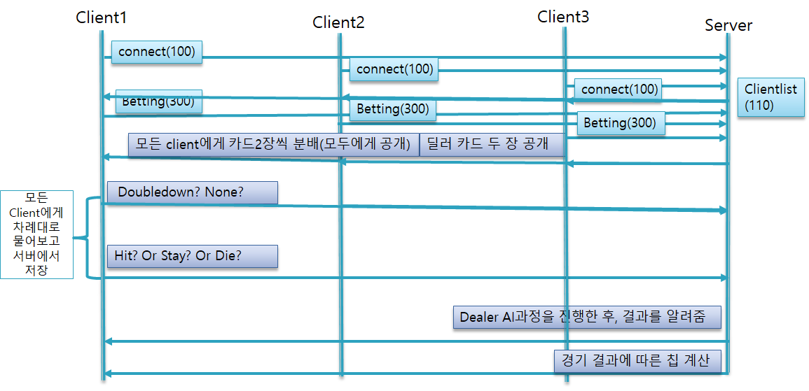
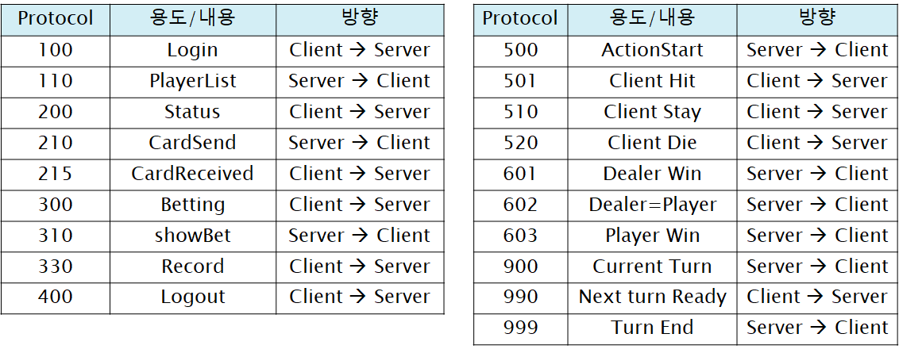

## 시스템 흐름도

## 시스템 구성도

- 시작단계
  - 클라이언트의 접속과 동시에 서버에서 클라이언트의 이름을 저장
  - 플레이어가 3명이 되면 서버에서 게임을 시작하고 게임시작을 클라이언트에게 알린다
- 베팅단계
  - 클라이언트의 순서(들어온순서)대로 베팅을 받게 되고 마지막 클라이언트의 베팅이 끝나면
  - 클라이언트들과 딜러에게 첫 카드(2장)을 서버에서 랜덤으로 제출해주고, 베팅정보를 다른 클라이언트들에게 뿌려준다
  - 여기서 doubledown 버튼을 누르게되면 비활성화 되었던 베팅버튼이 활성화된다.
- 결정 단계
  - 클라이언트는 서버가 전송해준 자신의 첫 카드와 딜러의 카드를 비교해서 결정(hit / stay / die)를 하게 된다.
    - hit을 누르게되면 서버는 hit버튼을 누른 클라이언트에게 카드 한 장을 전송해주고 다른 클라이언트들에게도 대상 클라이언트가 카드를 받았다는 것을 표시
      - 만약 hit과정에서 bust되었을때(카드의 합이 21을 넘었을때)는 서버에서 패배한 것으로 구현, 클라이언트에서는 bust되었다고  표시 
      - 만약 hit과정이나 첫 카드에서 카드의 합이 21이 되면 서버에서 승리 한 것으로 구현, 클라이언트에서는 blackjack이라고 표시
    - stay를 누르게되면 서버는 대상 클라이언트의 결정 단계의 턴이 끝났다는 것을 기록해두고 다른 버튼은 비활성화, 클라이언트가 stay했다고 표시
    - die를 누르게되면 서버는 대상 클라이언트의 결정 단계의 턴이 끝났다는 것을 기록해두고 클라이언트에서는 죽었다고 표시함과 동시에 받은 카드를 뒤집어두도록 표시, 클라이언트가 더이상 게임에 참여할 수 없다고 표시
- 결과 단계
  - 서버에서 모든 클라이언트들의 턴종료(stay / die / bust / blackjack)을 접수하는 순간, 서버는 클라이언트의 승패를 판단하고 승패에 따라서 칩을 계산해서 각 클라이언트의 승패와 총 칩수를 뿌려준다.
  - 만약 모든 클라이언트들이 결과값을 확인하고 next turn버튼을 누르게 되면 모든 클라이언트가 다음 턴을 위한 준비가 되었다고 서버가 인지하고 다음 게임을 진행한다
    - 여기서 만약 보유 칩 수가 0개인 클라이언트가 다음 게임으로 넘어가려고 한다면 자동으로 보유 칩수가 0개인 클라이언트를 종료시키고 다른 클라이언트들에게는 보유 칩 수가 0개인 클라이언트는 퇴장당했다고 알린다.

## 프로토콜 목록

