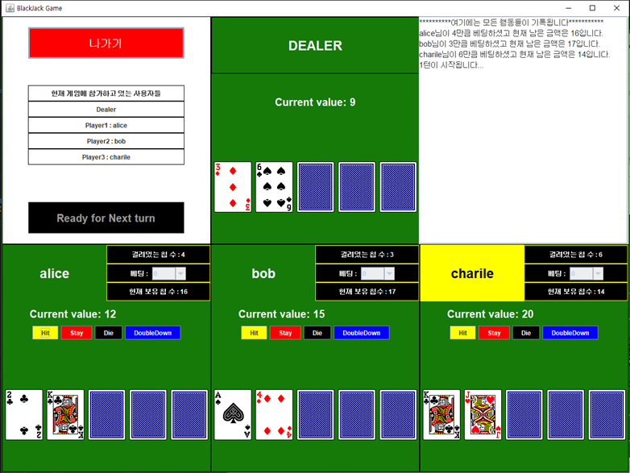

## 네트워크 버전 블랙잭 게임

 네트워크 프로그래밍 과목의 텀 프로젝트

#### 개요

컴퓨터 딜러와 플레이어 3명이 랜덤으로 카드를 받고, 베팅 과정을 거쳐서 칩을 따내는 게임

네트워크 : 기본적으로 플레이어의 요청에 따라서 서버가 응답을 해주는데 모든 클라이언트에게 똑같은 응답을 보내줘서 모든 클라이언트가 동시에 똑같은 화면을 보게 구현

---

#### 기능

- 블랙잭 게임 => 카드를 받고 카드의 값을 서로 비교하는 게임기능

- 베팅기능 
  - 승리 => 베팅한 칩의 2배를 돌려받음
  - 동점 => 베팅한 칩을 그대로 돌려받음
  - 패배 => 베팅한 모든 칩을 반납
- 카드를 랜덤으로 배분, 최대 5장까지 받을 수 있음
- 상황에 맞춰서 카드를 받거나 안받는 딜러 AI구현
- 플레이어는 hit / stay / die / doubledown의 결정을 내릴 수 있다.
- 게임진행 사항(플레이어의 선택, 베팅, 결과 등)을 기록

---

